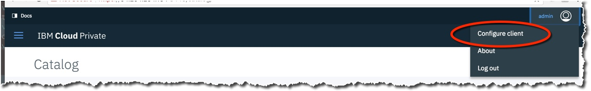

## Containerizing a process for deployment

**In this section**, you will get all the components installed to begin interacting with the cluster with things such as the docker, helm and kubectl. If you're familiar with using these clients you can skip this section.... otherwise, we'll start installing our clients on Ubuntu 16.04 desktop.

---

## Task 1: Installing docker on the client machine

Installing docker locally is helpful to build and test containers locally. It's convenient as a client for running containers, but also as a quick and easy way to connect and push docker images to the ICP cluster where they can be deployed.

1. Uninstall any old docker versions

```
$ sudo apt-get remove docker docker-engine docker.io

```


2. Configure the apt repository for Docker
```
sudo apt-get install apt-transport-https ca-certificates curl software-properties-common -y
curl -fsSL https://download.docker.com/linux/ubuntu/gpg | sudo apt-key add -
sudo apt-key fingerprint 0ebfcd88
sudo add-apt-repository "deb [arch=amd64] https://download.docker.com/linux/ubuntu $(lsb_release -cs) stable"
sudo apt-get update
```

3. Install docker

```
apt-get install docker-ce -y
systemctl start docker
```

4. Test the docker engine by running the "hello-world" containers

```
virtuser@devbox:~$ sudo docker run -d hello-world
Unable to find image 'hello-world:latest' locally
latest: Pulling from library/hello-world
ca4f61b1923c: Pull complete
Digest: sha256:66ef312bbac49c39a89aa9bcc3cb4f3c9e7de3788c944158df3ee0176d32b751
Status: Downloaded newer image for hello-world:latest
e176cbbe173e3c7fac5355df3b7572e82f47b6eaba2790b6aac8ccc7c27d8705

```


---


## Task 2: Installing the kubectl client

1. Download the kubectl client
```
$ curl -LO https://storage.googleapis.com/kubernetes-release/release/$(curl -s https://storage.googleapis.com/kubernetes-release/release/stable.txt)/bin/linux/amd64/kubectl
  % Total    % Received % Xferd  Average Speed   Time    Time     Time  Current
                                 Dload  Upload   Total   Spent    Left  Speed
100 64.2M  100 64.2M    0     0  1855k      0  0:00:35  0:00:35 --:--:-- 1853k
```

2. Make the binary executable and put it in the path
```
$ chmod +x ./kubectl
$ sudo mv ./kubectl /usr/local/bin/kubectl

```

With the kubectl client in place, it can be configured to connect to the ICP cluster. Choose the "configure client" from the menu and paste the provided commands to the command line.



3. Test the newly configured client.
```
$ kubectl cluster-info


```

Summary: The newly configured kubectl client should provide details about the ICP cluster and provide an opportunity to run and manage workloads in cluster.


---

## Task 3: Installing the Helm client

Installing the helm client is helpful for testing packaging up charts to upload to the ICP catalog.

1. Download and install the helm client
```
$ curl https://raw.githubusercontent.com/kubernetes/helm/master/scripts/get | bash
```

2. configure helm to connect to whatever cluster kubectl is configured to connect to.
```
$ helm init

```

---

## Task 4: Installing the bx client and pr sub-command

The bx client is best for connecting to the public IBM Cloud... however the 'pr' subcommand is helpful to upload packaged helm charts to the helm repository for the ICP cluster. In this section we'll install the bx command and add the pr subcommand.

1. Download and install the bx client
```
curl -fsSL https://clis.ng.bluemix.net/install/linux | sh
```

2. From the Command Line Tools -> Cloud Private cli menu download the 'pr' plugin and install using the bx command typing:

```
$ bx plugin install icp-linux-amd64
```

---

Resources:

- [Adding applications to the ICP catalog](https://www.ibm.com/support/knowledgecenter/en/SSBS6K_2.1.0/app_center/add_package_offline.html)

- [kubectl Installation Documentation](https://kubernetes.io/docs/tasks/tools/install-kubectl/)

- [ Docker Installation Documentation](https://docs.docker.com/engine/installation/linux/docker-ce/ubuntu/)


---
