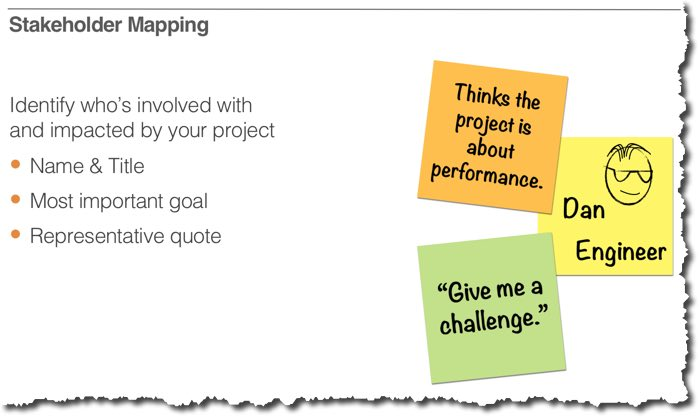

## Understanding BB&T's Current Environment & Objectives

**1. Initiative stakeholders**

a) _Please describe the stakeholders affected by building the Test & Learn environment as well as their interests and concerns._

---

**2. Current Application Portfolio and Development Strategy**

a) _Please describe the current application portfolio:_
   - number of applications (custom and packaged)
   - how many releases a year for the "typical" application?
   - key challenges within the application portfolio

b) _Please describe the current state of development:_
   - development processes
   - development stack
   - release frequency

c) _Please describe key 2018 development objectives:_

---

**3. Desired Outcomes**

a) Please describe the top 3 desired outcomes from building a test environment.

Item  | Actors Affected  | Outcome Description
--|---|---|
01.  |   |   |
02.  |   |   |
03.  |   |   |

---

**_Are there any key concerns held by any of the stakeholders?_**

---

**_Open Items and Todo's for this segment_**

Item  | Owner  | Item Description | Target Date
--|---|---|---|
01.  |   |   |
02.  |   |   |
03.  |   |   |
